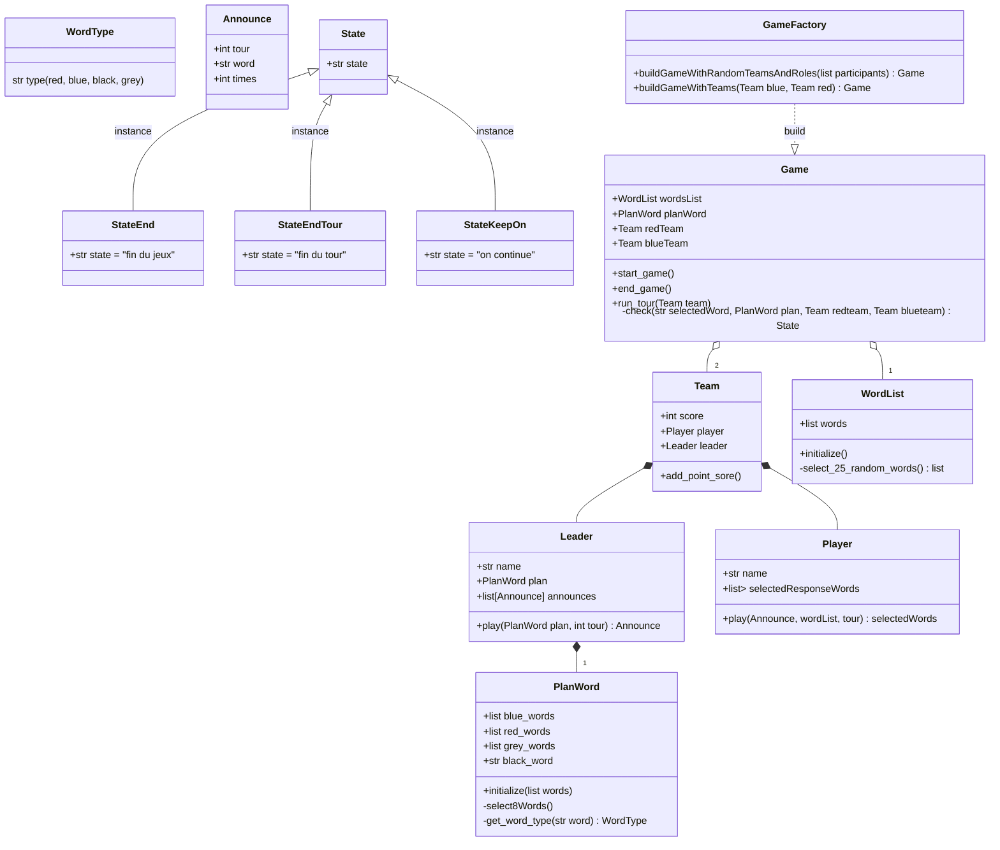

# Design du programme
## Architecture
## Classes
### Features

### User Inerface (UI)
```mermaid
classDiagram
  class Dimensions {
    +int width
    +int height
  }
  class Card {
    +Dimensions
    +str word_to_display
    +display()
  }
  class CardGrid {
    +list<Card> cards
    +display()
  }
  class ScoreDisplayer {
    +int red_team_score
    +int blue_team_score
    +display()
  }
  class TourDisplayer {
    +str messsage
    +display()
  }
  class TeamDisplayer {
    +Team team
    +display()
  }
  class AnnounceDisplayer {
    +Announce announce
    +display()
  }
  class Sreen {
    +CardGrid cardGrid
    +ScoreDisplayer scoreDisplayer
    +TourDisplayer tourDisplayer
    +TeamDisplayer teamDisplayer
  }
  class PlayerScreen {
    +AnnounceDisplayer announceDisplayer
    +display()
  }
  class LeaderSreen {
    +PlanWord plan
    +display()
    -applyPlanWord() transformedPlanGrid
  }
  Screen <|-- PlayerScreen
  Screen <|-- LeaderScreen
  class Board {
    +Dimensions dimensions
    +checkIn() Screen
    +display()

  }
