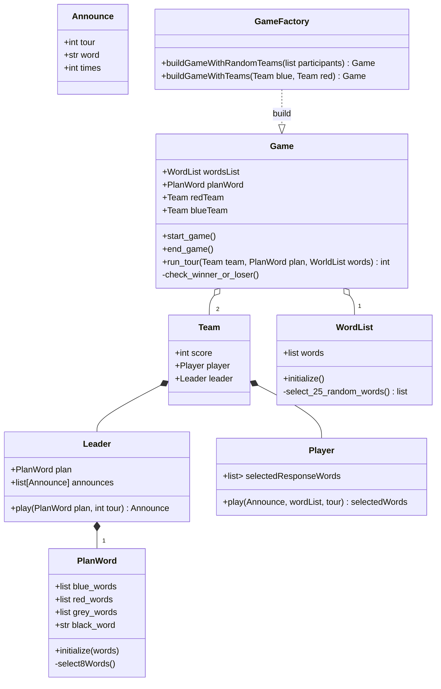

# Design du programme
## Architecture
## Classes
### Features

### User Inerface (UI)
```mermaid
classDiagram
  class Dimensions {
    +int width
    +int height
  }
  class Card {
    +Dimensions
    +str word_to_display
    +display()
  }
  class ScoreDisplayer {
    +int red_team_score
    +int blue_team_score
    +display()
  }
  class Board {
    +Dimensions dimensions
    +ScoreDisplayer scoreDisplayer
    +list[Card] cards
    +display()

  }
